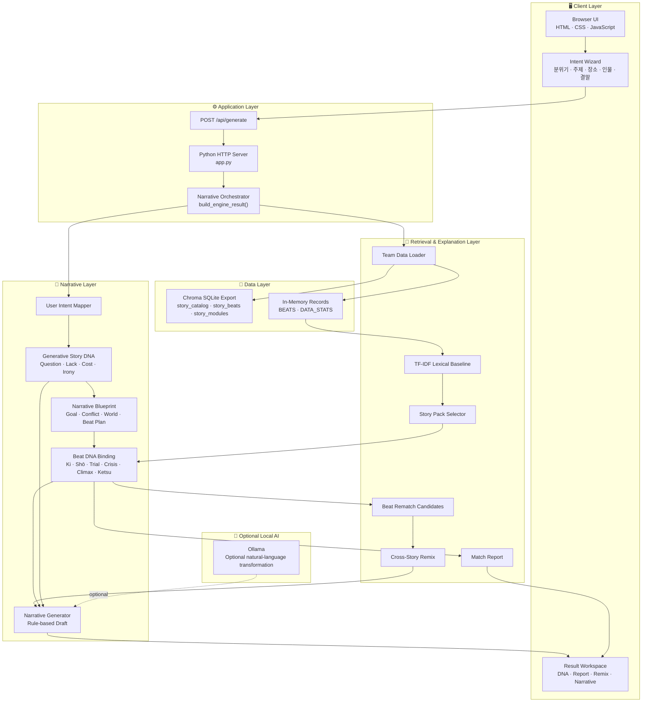
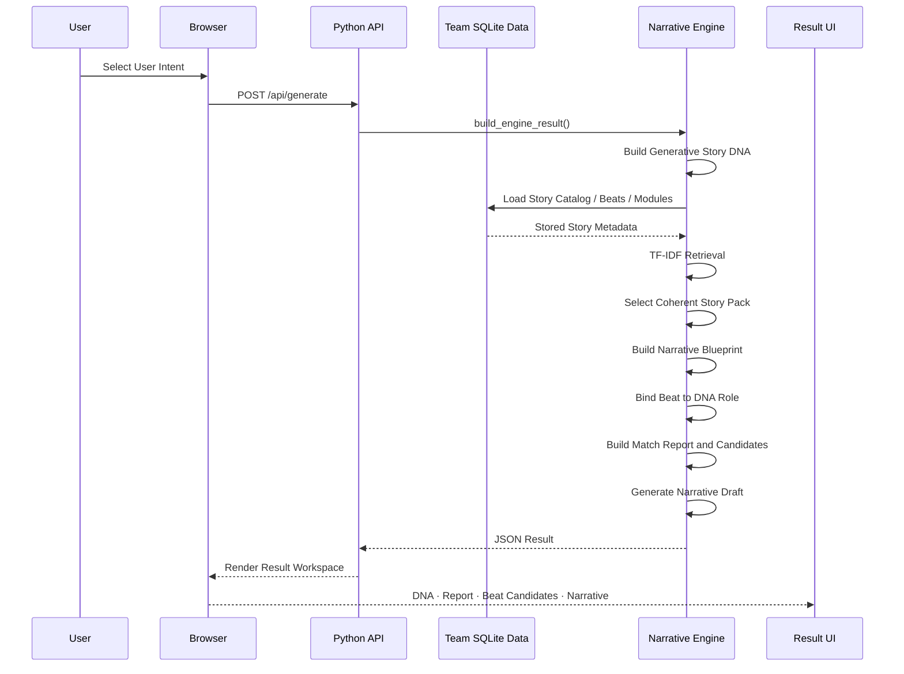
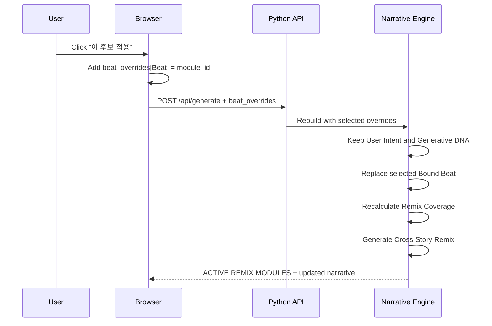
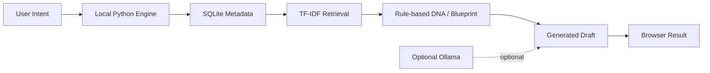

# Narrative Engine System Architecture

## Overview

Narrative Engine은 제주 설화 데이터의 검색용 Narrative Metadata를 이용해 새로운 이야기의 생성용 Story DNA를 설계하고, 원천 사건을 Beat 제약에 연결한 뒤 새로운 서사를 생성하는 로컬 Narrative AI입니다.

현재 MVP는 외부 유료 API 없이 Python 표준 라이브러리와 팀 프로젝트의 SQLite 데이터만으로 실행됩니다.

세부 문서는 [architecture 문서 목록](architecture/README.md)에서 확인할 수 있습니다.

---

## High-Level Architecture



---

## Data Flow

### Initial Generation



### Cross-Story Remix



---

## Module Structure

```bash
narrative-lab/
├── app.py                         # HTTP server and Narrative Engine
├── index.html                     # Intent wizard and result layout
├── script.js                      # API calls, rendering, rematch interaction
├── styles.css                     # UI styling and responsive layout
├── data/
│   └── story_modules.json         # Local fallback data
├── team-data/
│   └── jeju-stories/
│       └── chroma_db/
│           └── chroma.sqlite3     # Team Story Pack source
├── tests/
│   ├── test_mvp1_1.py             # Legacy / personal narrative compatibility
│   ├── test_mvp1_3.py             # MVP1.3 scenarios
│   └── test_mvp2.py               # DNA, retrieval, rematch, remix tests
├── docs/
│   ├── ARCHITECTURE.md            # This document
│   └── features/                  # Feature-level specifications
└── README.md
```

### `app.py` 내부 책임

| 영역 | 주요 책임 |
|---|---|
| Data Loader | SQLite collection을 읽고 Story Beat record로 정규화 |
| Retrieval | query token과 `search_text`의 TF-IDF lexical score 계산 |
| Story Pack | 중심 원천 설화 선택 |
| DNA Builder | User Intent를 Question·Lack·Cost·Irony로 변환 |
| Blueprint | 주인공·목표·갈등·세계·Beat Plan 생성 |
| Binding | 각 Beat와 원천 사건 및 DNA 역할 연결 |
| Match Report | 점수·커버리지·바인딩·리믹스 범위 설명 |
| Remix | `beat_overrides`로 선택 사건 교체 |
| Generator | Bound Beat와 DNA를 결합해 서사 초안 생성 |
| HTTP Handler | 정적 파일과 `/api/generate` 제공 |

---

## Technology Stack

| Layer | Technology | Purpose |
|---|---|---|
| Frontend | HTML5, CSS3, Vanilla JavaScript | Wizard, result workspace, remix interaction |
| Backend | Python 3.10+ standard library | Local HTTP API and engine orchestration |
| Data | SQLite / Chroma export | Team Story Pack storage |
| Retrieval | TF-IDF-style lexical baseline | Transparent metadata matching |
| Test | Python `unittest` | API contract and narrative flow verification |
| Optional AI | Ollama | Optional local natural-language transformation |
| Hosting | Local process | `python app.py` |

---

## Zero-Cost Strategy



| Resource | Cost | Strategy |
|---|---:|---|
| External LLM API | ₩0 | MVP baseline uses deterministic rules |
| Vector database service | ₩0 | Existing SQLite export is read locally |
| Backend hosting | ₩0 | Local Python server |
| Dataset | ₩0 | Existing team Story Pack reuse |
| Optional local LLM | Local machine cost | Ollama can be enabled only when available |

The zero-cost strategy trades model-level semantic quality for reproducibility, inspectable scores, and a low-friction portfolio demo.

---

## API Contract

### `POST /api/generate`

#### Basic request

```json
{
  "engine": {
    "atmosphere": "mysterious",
    "theme": "forbidden_promise",
    "location": "cave",
    "character": "outsider",
    "ending": "echo"
  },
  "context": {}
}
```

#### Remix request

```json
{
  "engine": {
    "atmosphere": "mysterious",
    "theme": "forbidden_promise",
    "location": "cave",
    "character": "outsider",
    "ending": "echo"
  },
  "context": {},
  "beat_overrides": {
    "Ki": "L_050_Ki",
    "Shō": "L_166_Shō"
  }
}
```

#### Main response groups

```text
generative_story_dna
narrative_blueprint
match_report
beat_recommendations
bound_beats
active_modules
remix
generated
data_source
```

---

## Current MVP Boundaries

### Implemented

- User Intent wizard
- Generative Story DNA
- Coherent Story Pack retrieval
- Match Report
- Beat-level candidate recommendations
- Click-to-remix `beat_overrides`
- Active Remix module display
- Rule-based narrative draft
- Legacy MVP input compatibility

### Not yet implemented

- Automatic DNA Validation of generated prose
- Semantic embedding retrieval
- Natural-language transformation of source events
- Persistent user sessions or saved remix history
- Production hosting and multi-user concurrency

---

## Verification Targets

The architecture should be evaluated with the following checks:

| Check | Question |
|---|---|
| Retrieval | Does the selected Story Pack match the User Intent? |
| Binding | Does each Beat have the correct DNA role? |
| Remix | Does clicking a candidate replace the correct Beat? |
| Visibility | Do `ACTIVE REMIX MODULES` and generated prose reflect the override? |
| Validation | Does the final prose preserve Question·Lack·Cost·Irony? |

---

*Last updated: 2026-08-25*
