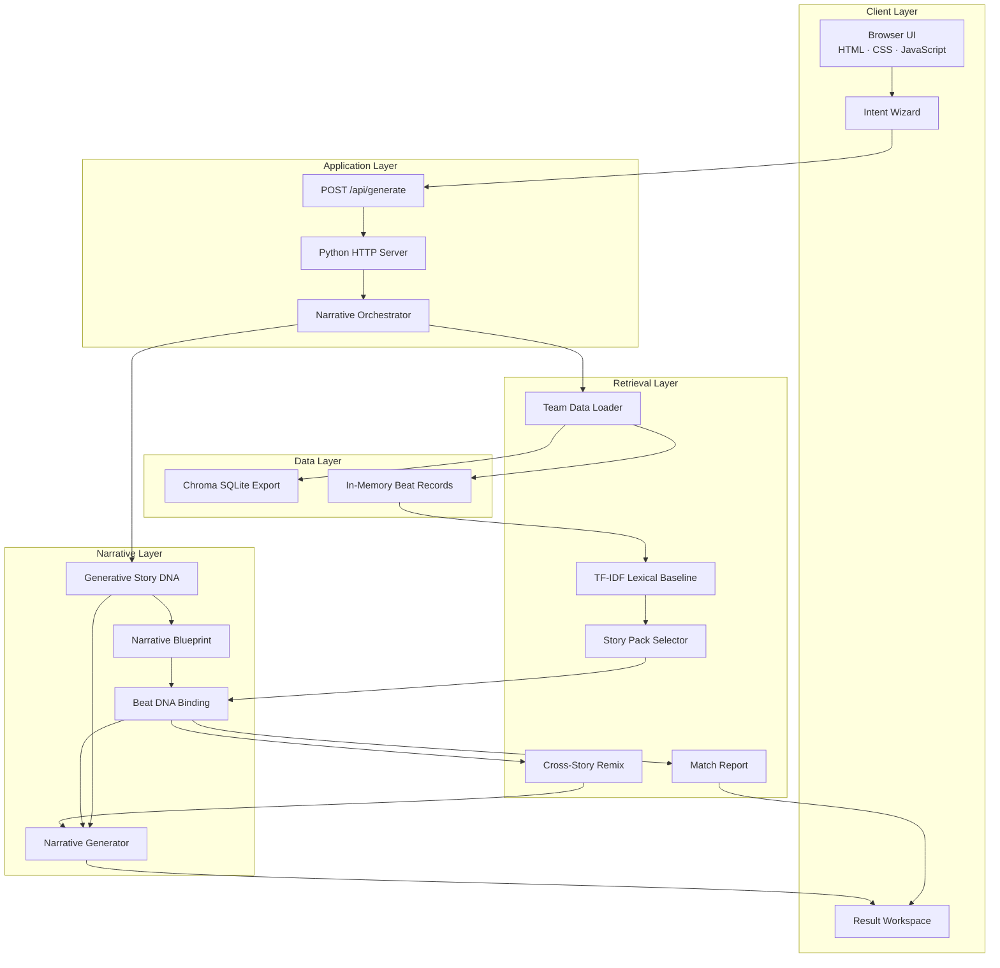

# High-Level Architecture

## Overview

Narrative Engine은 사용자의 생성 의도를 Generative Story DNA로 변환하고, 제주 설화 데이터에서 원천 사건을 검색·바인딩해 이야기를 생성합니다.



## Design Principle

검색용 Story DNA와 생성용 Story DNA를 분리한다.

```text
Stored Story Metadata
  → Retrieval
  → Generative Story DNA
  → Blueprint Constraint
  → Bound Beat
  → Narrative Draft
```

## Runtime Modes

- Coherent Story Pack mode: 하나의 원천 설화로 기본 생성
- Cross-Story Remix mode: 사용자가 Beat 후보를 선택한 경우 여러 원천 설화를 조합
