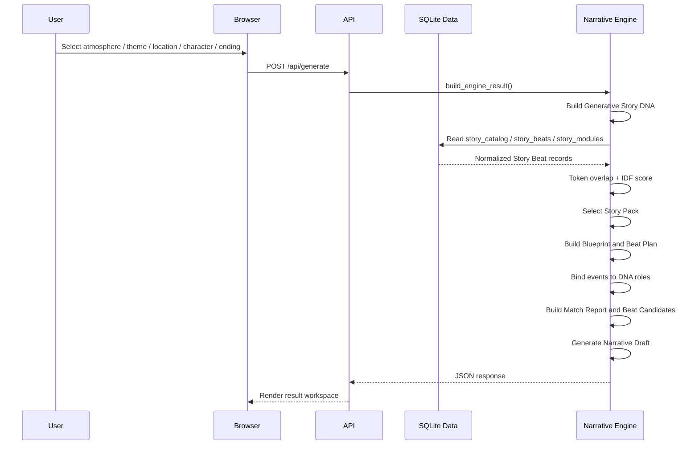
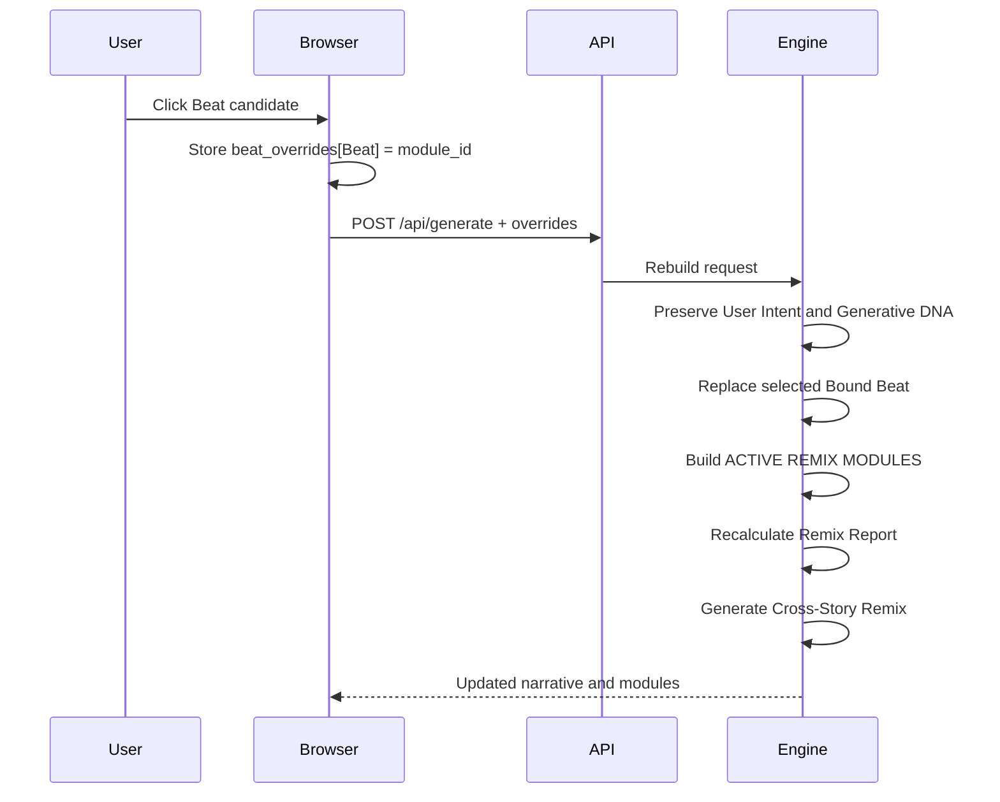

# Data Flow

## Initial Generation



## Cross-Story Remix



## Main State Objects

```text
engine
  → user selection values

generative_story_dna
  → Question / Lack / Cost / Irony

narrative_blueprint
  → protagonist / goal / conflict / world / beat_plan

bound_beats
  → Beat / DNA focus / source story / event text

beat_overrides
  → user-selected Beat replacement map

generated
  → title / text / generation_mode
```
