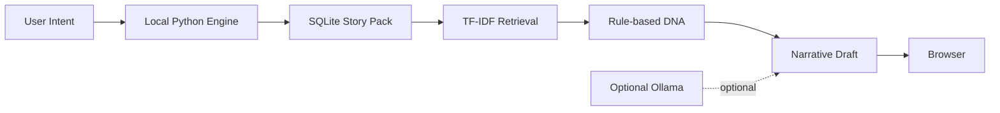

# Zero-Cost Strategy

## Runtime Strategy



## Cost Breakdown

| Resource | Cost | Strategy |
|---|---:|---|
| LLM API | ₩0 | MVP는 규칙 기반 DNA와 생성 사용 |
| Vector DB service | ₩0 | Chroma SQLite export를 로컬에서 읽음 |
| Hosting | ₩0 | Python local server |
| Database | ₩0 | 저장된 SQLite 파일 재사용 |
| Dataset acquisition | ₩0 | 기존 팀 Story Pack 활용 |
| Optional local LLM | 추가 비용 없음 | Ollama가 설치된 경우에만 사용 |

## Trade-off

```text
비용과 의존성 감소
  ↕
의미 검색과 자연어 품질 제한
```

현재 MVP는 모델 성능보다 다음을 우선한다.

- 재현 가능한 결과
- 검색 점수의 설명 가능성
- 로컬 실행 가능성
- 포트폴리오에서 구조를 직접 설명할 수 있는 코드
