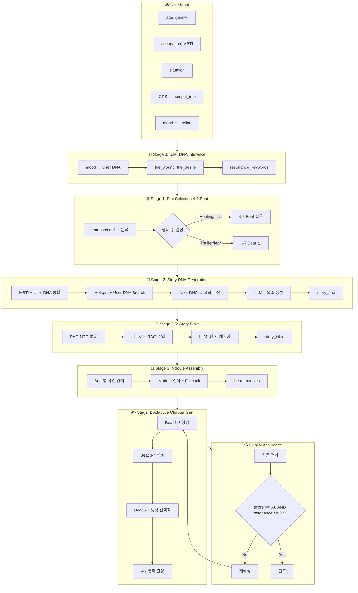

# 🎭 Narrative Engine Structure (Bullks/AWS + Tiger 통합)

## 제주 설화 기반 Walk-through 스토리텔링 엔진 (유연한 4-7챕터 구조)

> **Version**: 8.0 (AWS Bedrock + Tiger Personalization)
> **Source Branch**: bullks/AWS + tiger (통합)
> **Last Updated**: 2024-12-19

---

## 목차

1. [Executive Summary](#1-executive-summary)
2. [핵심 차별점](#2-핵심-차별점)
3. [4.5-Stage 생성 파이프라인](#3-45-stage-생성-파이프라인)
4. [Stage별 상세 플로우](#4-stage별-상세-플로우)
5. [RAG 시스템](#5-rag-시스템-jejuragsystemv4)
6. [개인화 메커니즘 (MBTI/직업 + User DNA)](#6-개인화-메커니즘)
7. [유연한 챕터 구조 (4-7개)](#7-유연한-챕터-구조-4-7개)
8. [품질 관리 시스템](#8-품질-관리-시스템)
9. [코드 구조](#9-코드-구조)

---

## 1. Executive Summary

### 1.1. 프로젝트 목표

**Mission**: GPS 기반 Walk-through 여행과 연동되는 **유연한 4-7챕터 스토리텔링** 경험 제공. 사용자의 사회적 정체성(직업/MBTI) **및 심리적 상태(User DNA: 상처/갈망)**를 반영한 개인화된 제주 설화 재해석.

### 1.2. 기술 스택

| 구성요소 | 기술 |
|---------|------|
| **LLM** | AWS Bedrock Claude 4.5 Sonnet (`claude-sonnet-4-5-20250929-v1:0`) |
| **Vector DB** | ChromaDB (4-Collection 구조) |
| **Embedding** | BGE-M3 Local (`bge-m3-local`) |
| **Frontend** | Streamlit |
| **Backend** | Python 3.11+ |
| **Cloud** | AWS (Bedrock, CloudWatch, S3) |

### 1.3. 핵심 특징

```
┌─────────────────────────────────────────────────────────────┐
│  🎯 유연한 4-7챕터 구조 (500-2000자 스케일링)                │
│  📍 GPS 기반 Geofencing (핫스팟 연동)                        │
│  🧬 듀얼 개인화: MBTI/직업 + User DNA (상처/갈망)            │
│  📖 Story Bible로 시리즈 일관성 보장                         │
│  🔄 User DNA ↔ Story DNA 매칭 & 동적 생성                   │
│  ⏱️ 물리적 제약: 1시간 내, 반경 500m 내                      │
└─────────────────────────────────────────────────────────────┘
```

---

## 2. 핵심 차별점

### 2.1. 통합 시스템 (Tiger + Bullks/AWS)

| 관점 | 기존 Tiger | 기존 Bullks/AWS | **통합 시스템** |
|------|------------|-----------------|-----------------|
| **이야기 형식** | 단편 (500-800자) | 10화 시리즈 (2000자) | **유연한 4-7챕터** (500-2000자) |
| **개인화 축** | User DNA (상처/갈망) | MBTI/직업 | **듀얼**: MBTI/직업 + User DNA |
| **구조 유연성** | 가변 Beat (4-7개) | 고정 10화 | **가변 Beat (4-7개)** |
| **일관성 도구** | Story DNA만 | Story Bible | **Story Bible + User DNA 매칭** |
| **생성 방식** | 전체 한 번에 | 2화씩 블록 | **적응적 블록 생성** |
| **물리적 제약** | 없음 | 1시간, 500m | 1시간, 500m 반경 |
| **사용 맥락** | 앉아서 몰입 | 걸으며 읽기 | **걸으며 읽기 (여행)** |

### 2.2. Story Bible: 시리즈 일관성의 핵심

```yaml
story_bible:
  protagonist:
    name: "지훈"
    age: 30
    job: "개발자"
    mbti: "INTJ"

  npc_persona:
    name: "강당장 할머니"      # RAG에서 검색 (절대 보존)
    role: "주인공을 시험하고 이끄는 존재"
    voice: "설화적 어투"

  key_item: "낡은 USB 메모리"  # Ch3 획득 → Ch8 활용

  narrative_style: "관찰자 시점 (3인칭)"
  reality_rule: "모든 현상은 심리적/물리적 이유가 있어야 함"
  tone: "신비로우면서도 현실적"
```

---

## 3. 5-Stage 생성 파이프라인 (User DNA 통합)

### 3.1. 전체 아키텍처

```
┌─────────────────────────────────────────────────────────────────────────┐
│                        USER INPUT (app.py)                              │
│  {age, gender, occupation, mbti, situation, gps_location, hotspot,      │
│   mood_selection}  ← NEW: 심리적 상태 입력                              │
└─────────────────────────────────────────────────────────────────────────┘
                                    │
                                    ▼
┌─────────────────────────────────────────────────────────────────────────┐
│  STAGE 0: User DNA Inference (NEW - Tiger 통합)                         │
│  ─────────────────────────────────────────────────────────────────────  │
│  Input:  mood_selection, situation, context                             │
│  Process: 3-Question UI → User DNA 추론                                 │
│  Output: user_dna {the_wound, the_desire, resonance_keywords}           │
└─────────────────────────────────────────────────────────────────────────┘
                                    │
                                    ▼
┌─────────────────────────────────────────────────────────────────────────┐
│  STAGE 1: Plot Pattern Selection (유연한 4-7 Beat)                      │
│  ─────────────────────────────────────────────────────────────────────  │
│  Input:  emotion, conflict, beat_count_preference (4-7)                 │
│  Output: beat_sequence (예: Ki → Shō → Trial → Ten → Ketsu)            │
└─────────────────────────────────────────────────────────────────────────┘
                                    │
                                    ▼
┌─────────────────────────────────────────────────────────────────────────┐
│  STAGE 2: Core Elements / Story DNA Generation (User DNA 반영)          │
│  ─────────────────────────────────────────────────────────────────────  │
│  Input:  user_info + MBTI keywords + hotspot_info + user_dna            │
│  Process: User DNA ↔ 설화 Story DNA 매칭 → LLM DNA 생성                │
│  Output: story_dna {the_question, the_lack, the_cost, the_irony}       │
│          ★ the_lack ← user_dna.the_wound 반영                          │
│          ★ the_question ← user_dna.the_desire 반영                     │
└─────────────────────────────────────────────────────────────────────────┘
                                    │
                                    ▼
┌─────────────────────────────────────────────────────────────────────────┐
│  STAGE 2.5: Story Bible Generation                                      │
│  ─────────────────────────────────────────────────────────────────────  │
│  Input:  story_dna + beat_modules + reference_stories                   │
│  Process: RAG NPC 발굴 (절대 보존) → LLM으로 빈 칸 채우기               │
│  Output: story_bible {protagonist, npc_persona, key_item, ...}          │
└─────────────────────────────────────────────────────────────────────────┘
                                    │
                                    ▼
┌─────────────────────────────────────────────────────────────────────────┐
│  STAGE 3: Beat-Module Assembly                                          │
│  ─────────────────────────────────────────────────────────────────────  │
│  Input:  beat_sequence (4-7개) + story_dna + location                   │
│  Process: STORY_BEATS + STORY_MODULES 검색 (Fallback 적용)              │
│  Output: beat_modules {Ki: {...}, Trial: {...}, Ketsu: {...}, ...}      │
└─────────────────────────────────────────────────────────────────────────┘
                                    │
                                    ▼
┌─────────────────────────────────────────────────────────────────────────┐
│  STAGE 4: Adaptive Chapter Block Generation (유연한 챕터 수)            │
│  ─────────────────────────────────────────────────────────────────────  │
│  Input:  story_bible + beat_modules + beat_sequence (4-7개)             │
│  Process: Beat별 1챕터 또는 2챕터씩 적응적 블록 생성                     │
│  Output: 4-7개 챕터 (각 ~100-300자, 총 500-2000자)                      │
└─────────────────────────────────────────────────────────────────────────┘
                                    │
                                    ▼
┌─────────────────────────────────────────────────────────────────────────┐
│  품질 평가 & 자동 수정 루프                                              │
│  ─────────────────────────────────────────────────────────────────────  │
│  folklore_score < 6.0 → 재생성                                          │
│  user_dna_resonance < 0.5 → 재생성 (NEW)                                │
│  영어 5단어 이상 / 한자 포함 → 재생성                                    │
└─────────────────────────────────────────────────────────────────────────┘
```

---

## 4. Stage별 상세 플로우

### 4.0. Stage 0: User DNA Inference (NEW - Tiger 통합)

```python
# User DNA 추론을 위한 Mood Selection
MOOD_TO_DNA_MAP = {
    "release": {  # 🌊 "비우고 싶다"
        "the_wound": "exhaustion",   # 소진, 지침
        "the_desire": "rest",        # 휴식, 쉼
        "keywords": ["비움", "내려놓음", "쉼", "평화"]
    },
    "presence": {  # 🌿 "지금 여기"
        "the_wound": "disconnection",  # 단절, 고립
        "the_desire": "mindfulness",   # 현재, 순간
        "keywords": ["지금", "여기", "순간", "마음"]
    },
    "courage": {  # ⛰️ "도전하고 싶다"
        "the_wound": "stagnation",    # 정체, 막힘
        "the_desire": "transformation",  # 변화, 성장
        "keywords": ["도전", "성장", "변화", "극복"]
    },
    "memory": {  # 🕯️ "그리움"
        "the_wound": "loss",          # 상실, 그리움
        "the_desire": "reconnection", # 재연결, 관계회복
        "keywords": ["그리움", "추억", "연결", "재회"]
    },
    "curiosity": {  # 🔮 "신비로움"
        "the_wound": "insignificance",  # 무의미, 존재감 부재
        "the_desire": "discovery",      # 발견, 깨달음
        "keywords": ["신비", "발견", "미지", "탐험"]
    }
}

def infer_user_dna(mood_selection, situation, context):
    """
    Mood Selection → User DNA 추론
    """
    base_dna = MOOD_TO_DNA_MAP.get(mood_selection, {})

    return {
        "the_wound": base_dna.get("the_wound"),
        "the_desire": base_dna.get("the_desire"),
        "resonance_keywords": base_dna.get("keywords", []),
        "intensity": _calculate_intensity(situation),
        "confidence": 0.8
    }
```

### 4.1. Stage 0.5: User Input & Preprocessing

```python
# app.py에서 수집하는 사용자 입력 (확장)
user_info = {
    "age": 30,
    "gender": "남성",
    "occupation": "개발자",
    "mbti": "INTJ",
    "situation": "코드 버그로 지쳤다",
    "mood_selection": "release"  # NEW: User DNA 추론용
}

# User DNA (Stage 0에서 추론)
user_dna = {
    "the_wound": "exhaustion",
    "the_desire": "rest",
    "resonance_keywords": ["비움", "내려놓음", "쉼", "평화"]
}

# GPS 기반 핫스팟 정보
hotspot_info = {
    "name": "한라수목원",
    "description": "제주의 자연을 담은 숲",
    "keywords": ["한라산", "수목원", "숲길", "자연"]
}
```

### 4.2. Stage 1: Plot Pattern Selection (유연한 4-7 Beat)

```python
def stage1_select_plot(emotion, conflict, beat_count_pref, user_dna=None):
    """
    감정/장르에 따라 유연한 4-7개 Beat 구조 선택
    beat_count_pref: 4-7 범위 (기본값: 5)
    """
    # RAG 검색: beat_count_pref에 맞는 플롯 패턴 검색
    result = rag.search_plot_patterns(
        emotion=emotion,
        conflict=conflict,
        beat_count_range=(beat_count_pref - 1, beat_count_pref + 1)
    )

    # User DNA 기반 Beat 구조 조정
    if user_dna:
        # 상처 유형에 따라 Crisis Beat 포함 여부 결정
        if user_dna["the_wound"] in ["exhaustion", "loss"]:
            # 힐링 지향: Crisis 생략, 부드러운 전개
            beat_count_pref = min(beat_count_pref, 5)

    return select_beat_sequence(emotion, beat_count_pref)
```

**유연한 Beat 구조 (4-7개 선택):**

| Beat | 역할 | 필수/선택 | Story DNA 연결 |
|------|------|-----------|----------------|
| **Ki (起)** | 도입, 일상/결핍 드러남 | 필수 | the_lack 드러남 |
| **Shō (承)** | 전개, 사건 심화 | 선택 | the_lack 심화 |
| **Trial** | 시련, 갈등 발생 | 선택 | the_cost 직면 |
| **Crisis** | 위기, 절정 직전 | 선택 | the_cost 심화 |
| **Ten (転)** | 반전, 깨달음 | 필수 | the_irony 드러남 |
| **Climax** | 절정, 최고 긴장 | 선택 | the_cost 해결 시도 |
| **Ketsu (結)** | 결말, 열린 마무리 | 필수 | the_question에 대한 (열린) 답 |

**Beat 조합 예시:**

| 챕터 수 | Beat 구조 예시 | 적합한 상황 |
|---------|---------------|-------------|
| **4개** | Ki → Trial → Ten → Ketsu | 짧은 힐링 스토리 |
| **5개** | Ki → Shō → Trial → Ten → Ketsu | 표준 구조 |
| **6개** | Ki → Shō → Trial → Crisis → Ten → Ketsu | 긴장감 있는 스토리 |
| **7개** | Ki → Shō → Trial → Crisis → Ten → Climax → Ketsu | 풀 스케일 서사 |

### 4.3. Stage 2: Core Elements / Story DNA Generation (User DNA 통합)

```python
def stage2_generate_dna(user_info, emotion, conflict, location, hotspot_info, user_dna=None):
    """
    핵심 4요소 생성 + 듀얼 개인화 (MBTI/직업 + User DNA)
    """
    # 1. MBTI 특성 파싱 (기존 유지)
    mbti = user_info.get('mbti', 'ENFP')
    mbti_info = _parse_mbti_traits(mbti)
    mbti_keywords = " ".join(mbti_info["keywords"])

    # 2. User DNA 기반 검색 쿼리 구성 (NEW)
    search_keywords = []
    if user_dna:
        # User DNA의 resonance_keywords를 검색에 활용
        search_keywords.extend(user_dna.get("resonance_keywords", []))
        # 상처/갈망 관련 설화 우선 검색
        wound_query = f"{user_dna['the_wound']} 관련 설화"
        desire_query = f"{user_dna['the_desire']} 관련 설화"

    # 3. Hotspot-First + User DNA 통합 검색
    if hotspot_info and hotspot_info.get('keywords'):
        combined_query = " ".join(hotspot_info['keywords'] + search_keywords)
        dna_references = catalog.query(query=combined_query)

    # 4. User DNA ↔ 설화 Story DNA 매칭 점수 계산 (NEW)
    if user_dna:
        dna_references = _rerank_by_user_dna(dna_references, user_dna)

    # 5. LLM으로 Story DNA 생성 (User DNA 반영)
    dna_prompt = f"""
    [Context]
    - 사용자 직업: {occupation}
    - 사용자 상황: {situation}
    - MBTI: {mbti}

    ## 🧬 사용자 심리 상태 (User DNA) - 반드시 반영
    - **상처 (Wound)**: {user_dna.get('the_wound', 'N/A')}
      → The Lack 설계 시 이 상처를 반영하세요
    - **갈망 (Desire)**: {user_dna.get('the_desire', 'N/A')}
      → The Question 설계 시 이 갈망을 반영하세요
    - **공명 키워드**: {user_dna.get('resonance_keywords', [])}
      → 배경/아이러니에 자연스럽게 녹여내세요

    [Task]
    다음 4가지 핵심 요소를 정의하세요:
    1. The Question: 주인공이 무의식적으로 던지는 질문 ← {user_dna.get('the_desire')} 반영
    2. The Lack: 주인공에게 부족한 것 ← {user_dna.get('the_wound')} 반영
    3. The Cost: 그것을 얻기 위해 치러야 할 대가
    4. The Irony: 이 이야기의 역설
    """

    return story_dna, dna_references


def _rerank_by_user_dna(references, user_dna):
    """
    User DNA ↔ 설화 Story DNA 매칭 점수로 재정렬 (Tiger 방식)
    """
    scored_refs = []
    for ref in references:
        score = 0.0

        # Wound 매칭 (40%)
        if user_dna["the_wound"] in ref.get("wounds_addressed", []):
            score += 0.4

        # Desire 매칭 (40%)
        if user_dna["the_desire"] in ref.get("desires_fulfilled", []):
            score += 0.4

        # Keyword 오버랩 (20%)
        triggers = ref.get("resonance_triggers", [])
        overlap = len(set(user_dna["resonance_keywords"]) & set(triggers))
        score += 0.2 * min(overlap / 3, 1.0)

        scored_refs.append((score, ref))

    scored_refs.sort(key=lambda x: x[0], reverse=True)
    return [ref for _, ref in scored_refs]
```

### 4.4. Stage 2.5: Story Bible Generation (Bullks 고유)

```python
def _generate_story_bible(user_info, story_dna, beat_modules, reference_stories):
    """
    RAG 데이터 절대 보존 전략
    - RAG에서 검색된 NPC는 '절대 보존 기준(Gold Standard)'
    - LLM은 빈 칸만 채우는 보조 역할
    """
    # 1. RAG 캐릭터 발굴 (절대 보존)
    rag_npc_name = None
    for beat_name in ['Sho', 'Trial', 'Crisis', 'Ki']:
        char_mod = beat_modules[beat_name].get('character')
        if char_mod and char_mod.get('name'):
            rag_npc_name = char_mod['name']  # 예: "강당장 할머니"
            break

    # 2. 기본값 생성 + RAG 데이터 선(先) 주입
    final_bible = _get_default_story_bible(occupation, mbti)
    final_bible["npc_persona"]["name"] = rag_npc_name  # 절대 변경 금지

    # 3. LLM으로 빈 칸 채우기 (key_item 등)
    # RAG NPC 이름은 프롬프트에 "절대 변경 금지"로 명시

    return final_bible
```

### 4.5. Stage 3: Beat-Module Assembly

```python
def stage3_assemble_modules(beat_sequence, story_dna, location, emotion, story_ids):
    """
    Fallback 로직으로 데이터 희소성 해결
    """
    # Fallback 매핑
    BEAT_FALLBACK_MAP = {
        "Crisis": "Trial",    # 위기 → 시련 데이터 재사용
        "Ten": "Trial",       # 반전 → 시련 데이터 재사용
        "Sho": "Ki",          # 전개 → 도입 데이터 재사용
    }

    beat_modules = {}
    for beat_name in beat_sequence:
        # 1. Beat 사건 검색
        beat_events = rag.search_beat_events(beat_name, emotion, story_ids)

        # 검색 결과 없으면 Fallback
        if not beat_events and beat_name in BEAT_FALLBACK_MAP:
            fallback_beat = BEAT_FALLBACK_MAP[beat_name]
            beat_events = rag.search_beat_events(fallback_beat, emotion, story_ids)

        # 2. Module 검색 (place, character, mood, wisdom)
        for mod_type in ["place", "character", "mood", "wisdom"]:
            found = rag.search_modules(mod_type, beat_name, location, emotion)
            # _select_diverse_candidate: 이전에 안 쓴 source 우선

        beat_modules[beat_name] = modules

    # 3. 후처리 Fallback: 모듈 비어있으면 인접 Beat에서 빌려옴

    return beat_modules
```

### 4.6. Stage 4: Adaptive Chapter Generation (유연한 4-7챕터)

```python
def generate_story_blocks(story_bible, beat_modules, beat_sequence, user_info, user_dna=None):
    """
    유연한 4-7개 챕터 생성 (Beat 수에 따라 적응적으로)

    beat_sequence 예시:
    - 4개: ["Ki", "Trial", "Ten", "Ketsu"]
    - 5개: ["Ki", "Shō", "Trial", "Ten", "Ketsu"]
    - 7개: ["Ki", "Shō", "Trial", "Crisis", "Ten", "Climax", "Ketsu"]
    """
    chapters = []
    beat_count = len(beat_sequence)

    # Beat별로 챕터 생성 (1 Beat = 1 Chapter)
    for idx, beat in enumerate(beat_sequence):
        # 이전 챕터 마지막 3문장 추출 (연속성)
        previous_context = ""
        if chapters:
            previous_context = _extract_last_sentences(chapters[-1], count=3)

        # 프롬프트 구성 (User DNA 개인화 지침 포함)
        prompt = f"""
        [직전 맥락]
        {previous_context}

        [이번 챕터 지시]
        - Beat: {beat}
        - 역할: {BEAT_ROLES[beat]}
        - Story DNA 연결: {BEAT_MODULE_MAP[beat]['story_dna_focus']}

        [Story Bible]
        - 주인공: {story_bible['protagonist']['name']}, {story_bible['protagonist']['job']}
        - NPC: {story_bible['npc_persona']['name']} (절대 변경 금지)
        - Key Item: {story_bible['key_item']}

        ## 🎯 개인화 지침 (User DNA 기반)
        1. **주인공**: {user_dna.get('the_wound', '')}의 고통을 겪는 인물
           → 독자가 "이건 내 이야기"로 느끼도록
        2. **여정**: {user_dna.get('the_desire', '')}를 향한 과정을 반영
           → 행동과 선택에 갈망 투영
        3. **분위기**: {user_dna.get('resonance_keywords', [])} 키워드로 배경 묘사

        [챕터 길이]
        - 100-300자 (Beat 중요도에 따라 조절)
        - Ki/Ketsu: ~150자, Trial/Climax: ~250자

        [출력 형식]
        [[CH{idx + 1}]] 내용...
        """

        # LLM 호출
        response = _call_llm(prompt)
        chapter = _parse_chapter(response, idx + 1)
        chapters.append(chapter)

    return chapters  # 4-7개 챕터


# Beat별 역할 정의
BEAT_ROLES = {
    "Ki": "도입 - 일상과 결핍 드러냄",
    "Shō": "전개 - 사건 심화",
    "Trial": "시련 - 갈등 발생",
    "Crisis": "위기 - 절정 직전 긴장",
    "Ten": "반전 - 깨달음/아이러니 드러남",
    "Climax": "절정 - 최고 긴장/대결",
    "Ketsu": "결말 - 열린 마무리"
}
```

---

## 5. RAG 시스템 (JejuRAGSystemV4)

### 5.1. 4-Collection 구조

```python
class JejuRAGSystemV4:
    """
    4개 Collection으로 분리된 RAG 시스템
    """
    collections = {
        "plot_patterns": "플롯 패턴 (Beat 구조)",
        "catalog": "설화 카탈로그 (전체 설화 메타데이터)",
        "beats": "Beat별 사건 (Ki, Sho, Trial...)",
        "modules": "재사용 가능 모듈 (Place, Character, Mood, Wisdom)"
    }
```

### 5.2. Hotspot-First Search

```python
def search_dna_references(emotion, conflict, location, occupation, situation,
                          hotspot_info=None, top_k=3):
    """
    핫스팟 우선 검색 전략
    """
    if hotspot_info and hotspot_info.get('keywords'):
        # 1단계: 핫스팟 키워드로만 검색
        search_query = " ".join(hotspot_info['keywords'])
        results = catalog.query(query=search_query, n_results=top_k*3)

        # 2단계: Strict Filtering
        valid_refs = []
        for ref in results:
            location_text = f"{ref['admin_region']} {ref['primary_place']} {ref['title']}"
            if any(kw.lower() in location_text.lower() for kw in hotspot_keywords):
                valid_refs.append(ref)

        return valid_refs[:top_k]

    # Fallback: 일반 검색
    return _standard_search(emotion, conflict, location, occupation, situation)
```

### 5.3. Location-based Re-ranking

```python
def _rerank_by_location(results, location_filter):
    """
    지역 키워드 매칭으로 재정렬
    """
    def calculate_score(ref):
        content = f"{ref['admin_region']} {ref['primary_place']} {ref['title']}"
        for idx, kw in enumerate(location_keywords):
            if kw.lower() in content.lower():
                return 100 - (idx * 10)  # 첫 번째 키워드 매칭이 높은 점수
        return 0

    scored = [(calculate_score(ref), ref) for ref in results]
    scored.sort(key=lambda x: x[0], reverse=True)
    return [ref for score, ref in scored]
```

---

## 6. 개인화 메커니즘 (MBTI/직업 + User DNA)

### 6.0. 듀얼 개인화 아키텍처 (NEW)

```
┌─────────────────────────────────────────────────────────────────────────┐
│                        듀얼 개인화 시스템                                 │
├─────────────────────────────────────────────────────────────────────────┤
│                                                                         │
│  [Layer A: 사회적 정체성 - 기존 유지]                                    │
│  ├─ MBTI 특성 → 행동 스타일, 대처 방식                                   │
│  ├─ 직업 어휘 → 메타포, 전문 용어                                        │
│  └─ 적용: 문체, 비유, 행동 패턴                                          │
│                                                                         │
│  [Layer B: 심리적 상태 - NEW (Tiger 통합)]                               │
│  ├─ User DNA (상처/갈망) → Story DNA 매칭                               │
│  ├─ Resonance Keywords → 설화 검색/재정렬                               │
│  └─ 적용: 주제, 캐릭터 결핍, 질문                                        │
│                                                                         │
│  [통합 적용]                                                             │
│  ├─ Stage 2: User DNA → Story DNA (the_lack, the_question)             │
│  ├─ Stage 4: MBTI/직업 → 문체/어휘, User DNA → 개인화 지침              │
│  └─ 결과: "내 이야기" 같은 공명 경험                                     │
│                                                                         │
└─────────────────────────────────────────────────────────────────────────┘
```

### 6.1. MBTI 특성 매핑 (기존)

```python
MBTI_TRAITS = {
    "E": {
        "label": "외향",
        "keywords": ["대화", "소통", "팀", "교류", "사람"],
        "action_style": "대화를 통해 해결"
    },
    "I": {
        "label": "내향",
        "keywords": ["사색", "혼자", "정리", "기록", "분석"],
        "action_style": "조용히 계획"
    },
    "S": {
        "label": "감각",
        "keywords": ["손으로", "현실", "눈에 띄는", "도구", "감각", "즉시"],
        "action_style": "보이는 것으로 행동"
    },
    "N": {
        "label": "직관",
        "keywords": ["패턴", "의미", "숨겨진", "상징", "영감", "미래"],
        "action_style": "의미 찾기"
    },
    "T": {
        "label": "사고",
        "keywords": ["논리", "분석", "비교", "객관", "규칙", "원리"],
        "action_style": "논리로 결정"
    },
    "F": {
        "label": "감정",
        "keywords": ["공감", "가치", "관계", "의미", "조화", "영향"],
        "action_style": "감정으로 결정"
    },
    "J": {
        "label": "판단",
        "keywords": ["구조", "계획", "마감", "순서", "결정", "완성"],
        "action_style": "체계적 접근"
    },
    "P": {
        "label": "인식",
        "keywords": ["유연", "개방", "탐색", "가능성", "임기응변", "부드러움"],
        "action_style": "적응적 접근"
    }
}
```

### 6.2. 직업별 어휘 제어

```python
JOB_VOCAB_MAP = {
    "개발자": {
        "aliases": ["프로그래머", "소프트웨어 엔지니어"],
        "pos": ["버그", "루프", "디버깅", "알고리즘", "리팩터링", "스택", "큐", "변수", "패턴"],
        "neg": []
    },
    "카페 사장": {
        "aliases": ["바리스타", "카페 운영자"],
        "pos": ["원두", "로스팅", "분쇄도", "물 온도", "추출", "크레마", "블렌딩", "향", "바디"],
        "neg": ["코드", "디버깅", "알고리즘", "컴파일", "배포", "API", "서버"]
    },
    "사진가": {
        "aliases": ["포토그래퍼"],
        "pos": ["셔터", "노출", "프레이밍", "피사계", "ISO", "초점", "암부", "하이라이트"],
        "neg": ["코드", "디버깅", "알고리즘", "컴파일", "배포", "API", "서버"]
    },
    # ... 기타 직업
}
```

**적용 예시:**
- 개발자: "이 문제는 무한 루프에 빠진 것 같았다. 디버깅이 필요했다."
- 카페 사장: "마치 과추출된 에스프레소처럼, 쓴 맛만 남았다."

### 6.3. User DNA 시스템 (NEW - Tiger 통합)

```python
# User DNA 데이터 구조
class UserDNA:
    the_wound: WoundType     # 사용자의 상처/결핍
    the_desire: DesireType   # 사용자의 갈망
    resonance_keywords: List[str]  # 공명 키워드 (5-10개)
    intensity: float         # 감정 강도 (0.0-1.0)
    confidence: float        # 추론 신뢰도 (0.0-1.0)


# 상처 유형 (WoundType)
WOUND_TYPES = {
    "exhaustion": "소진, 지침 - 오랜 노력 후 탈진",
    "loss": "상실, 그리움 - 떠나간 존재에 대한 아픔",
    "stagnation": "정체, 막힘 - 앞으로 나아가지 못하는 답답함",
    "disconnection": "단절, 고립 - 관계의 부재",
    "insignificance": "무의미, 존재감 부재 - 나의 가치에 대한 의문",
    "arrogance": "교만, 자만 - 성공 뒤의 공허함",
    "fear": "두려움, 불안 - 미래에 대한 걱정",
    "grief": "슬픔, 애도 - 깊은 상실감",
    "restlessness": "불안정, 초조 - 쉬지 못하는 마음"
}

# 갈망 유형 (DesireType)
DESIRE_TYPES = {
    "rest": "휴식, 쉼 - 진정한 안식",
    "meaning": "의미, 목적 - 삶의 방향",
    "transformation": "변화, 성장 - 새로운 나",
    "reconnection": "재연결, 관계회복 - 다시 이어지는 끈",
    "discovery": "발견, 깨달음 - 새로운 통찰",
    "healing": "치유, 회복 - 상처의 아뭄",
    "courage": "용기, 도전 - 두려움 극복",
    "peace": "평화, 안정 - 마음의 고요",
    "legacy": "유산, 흔적 - 의미있는 남김",
    "mindfulness": "현재, 순간 - 지금 여기"
}
```

**User DNA → Story DNA 매칭 로직:**

| User DNA | Story DNA | 연결 방식 |
|----------|-----------|-----------|
| **the_wound** | **the_lack** | 주인공의 결핍 = 사용자의 상처 |
| **the_desire** | **the_question** | 이야기의 질문 = 사용자의 갈망 |
| **resonance_keywords** | 설화 검색 | 키워드 매칭으로 관련 설화 우선 선택 |

**매칭 점수 계산:**
```python
def calculate_resonance_score(user_dna, story_metadata):
    """
    User DNA ↔ Story DNA 공명 점수 (0.0 ~ 1.0)
    """
    score = 0.0

    # Wound 매칭 (40%)
    if user_dna.the_wound in story_metadata.get("wounds_addressed", []):
        score += 0.4

    # Desire 매칭 (40%)
    if user_dna.the_desire in story_metadata.get("desires_fulfilled", []):
        score += 0.4

    # Keyword 오버랩 (20%)
    triggers = story_metadata.get("resonance_triggers", [])
    overlap = len(set(user_dna.resonance_keywords) & set(triggers))
    score += 0.2 * min(overlap / 3, 1.0)

    return min(score, 1.0)
```

---

## 7. 유연한 챕터 구조 (4-7개)

### 7.1. Beat 기반 챕터 구조

**기존 10화 고정 → 유연한 4-7개 Beat 기반 구조로 변경**

```
┌─────────────────────────────────────────────────────────────────────────┐
│                     유연한 Beat 기반 챕터 시스템                          │
├─────────────────────────────────────────────────────────────────────────┤
│                                                                         │
│  [필수 Beat - 3개]                                                       │
│  ├─ Ki (起): 도입 - 일상과 결핍 드러남                                   │
│  ├─ Ten (転): 반전 - 깨달음/아이러니 드러남                              │
│  └─ Ketsu (結): 결말 - 열린 마무리                                       │
│                                                                         │
│  [선택 Beat - 4개 중 1-4개 선택]                                         │
│  ├─ Shō (承): 전개 - 사건 심화                                           │
│  ├─ Trial: 시련 - 갈등 발생                                              │
│  ├─ Crisis: 위기 - 절정 직전 긴장                                        │
│  └─ Climax: 절정 - 최고 긴장/대결                                        │
│                                                                         │
│  [조합 예시]                                                             │
│  4챕터: Ki → Trial → Ten → Ketsu (힐링/짧은 스토리)                      │
│  5챕터: Ki → Shō → Trial → Ten → Ketsu (표준)                           │
│  6챕터: Ki → Shō → Trial → Crisis → Ten → Ketsu (긴장감)                │
│  7챕터: Ki → Shō → Trial → Crisis → Ten → Climax → Ketsu (풀 스케일)    │
│                                                                         │
└─────────────────────────────────────────────────────────────────────────┘
```

### 7.2. 챕터 수 결정 기준

| 요소 | 4챕터 | 5챕터 | 6-7챕터 |
|------|-------|-------|---------|
| **User DNA wound** | exhaustion, loss | stagnation, disconnection | fear, arrogance |
| **Emotion** | Healing, Romantic | Sweet_Potato, Bizarre | Thriller, Cider |
| **이야기 분량** | 400-600자 | 600-1000자 | 1000-2000자 |
| **여행 상황** | 짧은 휴식 | 보통 산책 | 긴 트레킹 |

```python
def determine_chapter_count(user_dna, emotion, travel_context):
    """
    User DNA, 감정, 여행 상황에 따라 챕터 수 결정
    """
    base_count = 5  # 기본값

    # User DNA 기반 조정
    if user_dna:
        if user_dna["the_wound"] in ["exhaustion", "loss", "grief"]:
            base_count -= 1  # 힐링 지향, 짧은 스토리
        elif user_dna["the_wound"] in ["fear", "arrogance", "restlessness"]:
            base_count += 1  # 긴장감 있는 긴 스토리

    # 감정 기반 조정
    if emotion in ["Thriller", "Cider"]:
        base_count += 1
    elif emotion in ["Healing", "Romantic"]:
        base_count -= 1

    # 범위 제한
    return max(4, min(7, base_count))
```

### 7.3. Real-Time & Spot Constraints (유지)

```python
SYSTEM_STYLE_RULES = """
[Real-Time & Spot Constraints - CRITICAL]

1. **시간 제한 (1시간)**: 이야기의 시작부터 끝까지 최대 1시간.
   ❌ 금지: "다음 날", "며칠 후", "잠이 들었다 깼다"
   ✅ 권장: 모든 사건은 현재 위치에서 연속적으로 발생

2. **장소 고정 (반경 500m)**: 주인공은 현재 위치를 벗어나지 않는다.
   - 용궁, 환상 세계 → 현실 풍경 위에 겹쳐 보이는 방식
   ❌ "바다로 들어갔다"
   ✅ "바다 위로 환영이 일렁였다"

3. **심리적 변화에 집중**: 공간적 모험 대신 주인공의 인식/감정 변화
"""
```

### 7.4. Beat별 Status 태그 시스템 (유연화)

```python
# Beat별 기본 Status 매핑
BEAT_STATUS_MAP = {
    "Ki": "Alone",      # 도입: 혼자 발견
    "Shō": "Together",  # 전개: NPC 등장
    "Trial": "Together", # 시련: 함께 갈등
    "Crisis": "Alone",  # 위기: 고립
    "Ten": "Alone",     # 반전: 혼자 깨달음
    "Climax": "Together", # 절정: NPC와 대결/화해
    "Ketsu": "Alone"    # 결말: 혼자 마무리
}

# 챕터별 Status 예시 (5챕터 표준 구조)
"""
Ch1 (Ki):     [Alone]    ─ 혼자 발견
Ch2 (Shō):    [Together] ─ NPC 등장
Ch3 (Trial):  [Together] ─ 갈등, {key_item} 획득
Ch4 (Ten):    [Alone]    ─ 깨달음, 아이러니 드러남
Ch5 (Ketsu):  [Alone]    ─ 열린 마무리
"""
```

### 7.5. Key Item 연속성 (Beat 기반)

```python
# Key Item 등장 Beat 매핑
KEY_ITEM_BEATS = {
    "acquisition": ["Shō", "Trial"],  # 획득 시점
    "usage": ["Climax", "Ten"]        # 활용 시점
}

# 예시 (5챕터 구조)
"""
Ch2 (Shō) or Ch3 (Trial): "{key_item}를 처음으로 손에 넣어라"
                            ↓
Ch4 (Ten): "{key_item}를 통해 진실을 깨닫는다"
"""
```

---

## 8. 품질 관리 시스템

### 8.1. 자동 평가 시스템

```python
def _evaluate_story(text, story_bible, user_info):
    """
    생성된 이야기 품질 평가
    """
    return {
        "folklore_score": 7.5,   # 설화 요소 반영도 (1-10)
        "profile_score": 8.0,    # 사용자 프로필 반영도 (1-10)
        "improvements": [
            "MBTI 특성 더 반영 필요",
            "제주 방언 대사 추가 권장"
        ]
    }
```

### 8.2. 재생성 조건

```python
# 재생성 트리거
if folklore_score < 6.0:
    regenerate_with_feedback(improvements)

if _count_english_words(text) >= 5:
    regenerate()  # 영어 단어 5개 이상

if not _is_valid_korean(text):
    regenerate()  # 한자/일본어 포함
```

### 8.3. 문체 규정

```python
SYSTEM_STYLE_RULES = """
[Output & Style Constraints]
- 전체 분량: 공백 포함 약 2000자 내외
- 챕터 형식: [[CH1]] ... [[CH10]] 태그 필수

**문체 규정 (매우 중요)**:
1. 내레이션(서술): 반드시 표준어 '해라체' (~한다, ~었다)
2. 대사(Dialogue): 등장인물의 대사에는 제주 방언 사용 가능

❌ 금지: ~수다, ~우다, ~해요, ~습니다
"""
```

---

## 9. 코드 구조

### 9.1. 파일 구조

```
bullks/AWS/
├── app.py                    # Streamlit 진입점
│   ├── 사용자 입력 수집
│   ├── GPS 위치 처리
│   ├── Walk-through 모드
│   └── JejuStoryTellerBedrock 호출
│
├── jeju_rag_bedrock.py       # 핵심 엔진
│   ├── JejuStoryTellerBedrock 클래스
│   ├── stage1_select_plot()
│   ├── stage2_generate_dna()
│   ├── _generate_story_bible()  # Stage 2.5
│   ├── stage3_assemble_modules()
│   └── generate_story_blocks()  # Stage 4
│
├── jeju_rag_system.py        # RAG 시스템
│   ├── JejuRAGSystemV4 클래스
│   ├── search_plot_patterns()
│   ├── search_dna_references()
│   ├── search_beat_events()
│   └── search_modules()
│
├── chroma_db/                # Vector DB
│   ├── plot_patterns/
│   ├── catalog/
│   ├── beats/
│   └── modules/
│
└── system_prompt.txt         # 시스템 프롬프트
```

### 9.2. 클래스 다이어그램

```
┌─────────────────────────────────────────────────────────────┐
│                    JejuStoryTellerBedrock                    │
├─────────────────────────────────────────────────────────────┤
│ - client: boto3.client (Bedrock)                            │
│ - rag: JejuRAGSystemV4                                      │
│ - story_bible: Dict                                         │
│ - system_prompt: str                                        │
├─────────────────────────────────────────────────────────────┤
│ + stage1_select_plot(emotion, conflict, ...) → Dict         │
│ + stage2_generate_dna(user_info, ...) → Tuple[Dict, List]   │
│ + _generate_story_bible(...) → Dict                         │
│ + stage3_assemble_modules(...) → Dict                       │
│ + generate_story_blocks(...) → List[str]                    │
│ - _call_ollama(messages, options) → str                     │
│ - _parse_mbti_traits(mbti) → Dict                           │
│ - _evaluate_story(text, ...) → Dict                         │
└─────────────────────────────────────────────────────────────┘
                              │
                              │ uses
                              ▼
┌─────────────────────────────────────────────────────────────┐
│                      JejuRAGSystemV4                         │
├─────────────────────────────────────────────────────────────┤
│ - client: chromadb.PersistentClient                         │
│ - embedding_model: SentenceTransformer                      │
│ - collections: Dict[str, Collection]                        │
├─────────────────────────────────────────────────────────────┤
│ + search_plot_patterns(emotion, ...) → Dict                 │
│ + search_dna_references(emotion, ...) → List[Dict]          │
│ + search_beat_events(beat, ...) → List[Dict]                │
│ + search_modules(type, beat, ...) → List[Dict]              │
└─────────────────────────────────────────────────────────────┘
```

---

## 부록: 플로우 다이어그램 (Mermaid)



---

## 변경 이력

| 날짜 | 버전 | 변경 내용 |
|------|------|----------|
| 2024-12-19 | v7.0 | 초기 분석 (Bullks/AWS 브랜치) |
| 2024-12-19 | **v8.0** | **Tiger 통합**: User DNA 기반 개인화 추가, 10화 고정 → 유연한 4-7챕터 구조로 변경, 듀얼 개인화 시스템 (MBTI/직업 + User DNA) |

---

*분석 완료: 2024-12-19*
*Source: bullks/AWS + tiger (통합)*
*Files: app.py, jeju_rag_bedrock.py, jeju_rag_system.py, personalization/*
