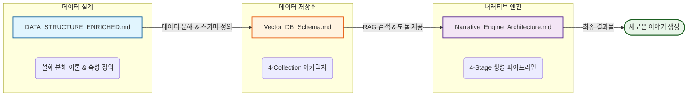
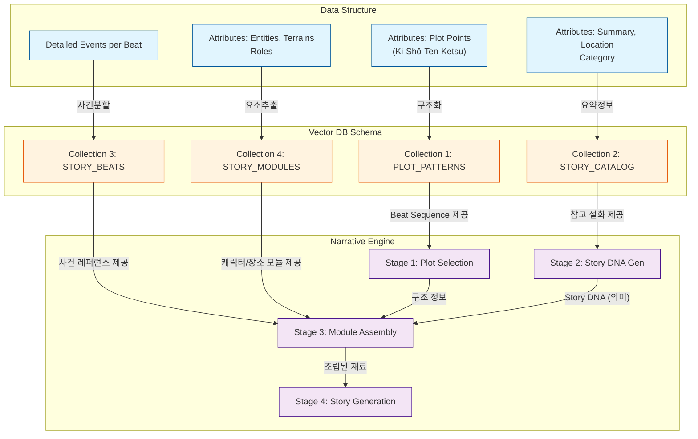

# 제주 설화 생성 시스템: 구조 및 데이터 흐름 분석 (System Architecture Map)

이 문서는 `DATA_STRUCTURE_ENRICHED.md`, `Vector_DB_Schema.md`, `Narrative_Engine_Architecture.md` 세 문서 간의 유기적인 연결 구조와 데이터 흐름을 시각적으로 정의합니다.

---

## 1. Macro Flow: 전체 시스템 흐름도

세 문서는 **[데이터 정의] → [데이터 저장] → [데이터 활용]**이라는 파이프라인을 형성합니다.



---

## 2. 문서 간 핵심 데이터 연결도 (Detailed Data Mapping)

`DATA_STRUCTURE`에서 정의된 데이터가 `Vector_DB`의 어떤 컬렉션으로 들어가고, 그것이 `Narrative_Engine`의 어떤 단계(Stage)에서 쓰이는지 보여주는 상세 연결도입니다.

### 2.1. 텍스트 도식 (Text Diagram)

```text
[SOURCE: DATA_STRUCTURE_ENRICHED.md]      [STORAGE: Vector_DB_Schema.md]           [PROCESS: Narrative_Engine.md]
====================================      ==============================           ==============================

1. 서사 구조 데이터   ───────────────────>  Collection ①                            Stage 1. 구조 결정
   (Attributes: plot_points)              [ PLOT_PATTERNS ]                 ┌────> [ Plot Pattern Selection ]
   - Beat Sequence (기승전결+α)    maps to    - Beat Count, Structure        │       - Input: 감정, 갈등
   - Emotion / Conflict                       - Metadata (Emotion/Conflict) │       - Output: Beat Sequence
                                                    │                       │
                                                    │ (Query) ──────────────┘
                                                    │
2. 메타데이터 요약    ───────────────────>  Collection ②                            Stage 2. 의미 설계 (DNA)
   (Attributes: summary, location)        [ STORY_CATALOG ]                 ┌────> [ Story DNA Generation ]
   - Category, Admin Region        maps to    - Summary, Region, Title      │       - Input: 위치, 감정
   - Keywords                                 - Light Metadata              │       - Output: Story DNA
                                                    │                       │         (Question, Lack, Cost, Irony)
                                                    │ (Query) ──────────────┘
                                                    │
3. 상세 사건 데이터   ───────────────────>  Collection ③                            Stage 3. 모듈 조립
   (Plot Points: event, function)         [ STORY_BEATS ]                   ┌────> [ Beat-Module Assembly ]
   - Specific Events per Beat      maps to    - Individual Beat Events      │       - Input: Beat Seq + DNA
   - Narrative Function                       - Search by Function/DNA      │       - Output: Beat Modules
                                                    │                       │
                                                    │ (Query) ──────────────┤
                                                    │                       │
4. 구성 요소 데이터   ───────────────────>  Collection ④                     │
   (Attributes: entities, terrains)       [ STORY_MODULES ]                 │
   - Characters (Entities)         maps to    - Type: Character, Place      │
   - Backgrounds (Terrains)                   - Type: Mood, Wisdom          │
   - Roles (Protagonist etc.)                 - Detailed Desc               │
                                                    │                       │
                                                    └───────────────────────┘
                                                                │
                                                                ▼
                                                       Stage 4. 이야기 생성
                                                       [ Story Generation ]
                                                       - Input: DNA + Modules
                                                       - Logic: 6대 원칙 & Emotion 가이드
```

### 2.2. 데이터 흐름도 (Mermaid Diagram)



### 2.3. 상세 매핑 테이블

| Source Definition (`DATA_STRUCTURE`) | Storage Schema (`Vector_DB`) | Engine Usage (`Narrative_Engine`) |
| :--- | :--- | :--- |
| **Attributes: plot_points**<br>- Beat Sequence (기승전결)<br>- Emotion / Conflict | **Collection ①: PLOT_PATTERNS**<br>- Beat Count, Structure<br>- Metadata (Emotion/Conflict) | **Stage 1. Plot Pattern Selection**<br>- Input: 사용자 감정, 갈등 선호<br>- Output: 이야기의 뼈대 (Beat Seq) |
| **Attributes: summary, location**<br>- Category, Admin Region<br>- Keywords | **Collection ②: STORY_CATALOG**<br>- Summary, Region, Title<br>- Light Metadata | **Stage 2. Story DNA Generation**<br>- Input: 위치, 감정<br>- Output: Story DNA (주제 의식) |
| **Plot Points: event, function**<br>- Specific Events per Beat<br>- Narrative Function | **Collection ③: STORY_BEATS**<br>- Individual Beat Events<br>- Search by Function/DNA | **Stage 3. Beat-Module Assembly**<br>- Input: DNA와 연결되는 사건 검색<br>- Output: Beat별 사건 레퍼런스 |
| **Attributes: entities, terrains**<br>- Character, Place, Mood<br>- Roles (Protagonist etc.) | **Collection ④: STORY_MODULES**<br>- Type: Character, Place<br>- Type: Mood, Wisdom | **Stage 3. Beat-Module Assembly**<br>- Input: DNA와 연결되는 소재 검색<br>- Output: 캐릭터, 장소, 분위기 모듈 |

---

## 3. ⚠️ 중요: 두 가지 Story DNA 구분

시스템에서 "Story DNA"라는 용어는 **두 가지 다른 개념**을 지칭합니다:

### 3.1. 저장용 Story DNA (Stored Story DNA)

**목적**: User DNA ↔ 설화 매칭/검색 (Personalization)

```text
[DATA_STRUCTURE_ENRICHED.md]     [Vector_DB_Schema.md]
       story_dna 필드      ────>   STORY_CATALOG 메타데이터

       - wounds_addressed         - wounds_addressed (JSON)
       - desires_fulfilled        - desires_fulfilled (JSON)
       - primary_wound            - primary_wound
       - primary_desire           - primary_desire
       - resonance_triggers       - resonance_triggers (JSON)
```

- **저장 위치**: enriched JSON 파일 + ChromaDB STORY_CATALOG
- **생성 시점**: 사전 배치 추출 (story_dna_extractor.py)
- **용도**: Resonance Scoring을 통한 개인화된 설화 추천

### 3.2. 생성용 Story DNA (Generated Story DNA)

**목적**: 새 이야기의 의미/주제 설계

```text
[Narrative_Engine_Architecture.md]
       Stage 2: Story DNA Generation

       LLM이 동적으로 생성 ────>  메모리 (생성 중에만 존재)

       - the_question (핵심 질문)
       - the_lack (주인공의 결핍)
       - the_cost (변화의 대가)
       - the_irony (역설적 통찰)
```

- **저장 위치**: 저장하지 않음 (메모리에만 존재)
- **생성 시점**: Stage 2에서 LLM이 매번 동적 생성
- **용도**: 이 이야기가 "무슨 말을 하려는가" 설계

### 3.3. 두 DNA의 관계

```text
┌─────────────────────────────────────────────────────────────────────┐
│                     Personalization Layer                           │
│  ┌─────────────┐    Resonance     ┌─────────────┐                  │
│  │  User DNA   │ ←─ Scoring ─→   │ Stored      │                  │
│  │  (wound,    │                  │ Story DNA   │  ← ChromaDB      │
│  │   desire)   │                  │ (wounds,    │                  │
│  └─────────────┘                  │  desires)   │                  │
│         │                         └─────────────┘                  │
│         │ 개인화된 참조 설화 선택                                     │
│         ▼                                                          │
└─────────────────────────────────────────────────────────────────────┘
                              │
                              ▼
┌─────────────────────────────────────────────────────────────────────┐
│                     4-Stage Pipeline                                │
│                                                                     │
│  Stage 1 → Stage 2 → Stage 3 → Stage 4                             │
│            ┌─────────────┐                                         │
│            │ Generated   │ ← LLM이 동적 생성                        │
│            │ Story DNA   │                                         │
│            │ (question,  │                                         │
│            │  lack,cost, │                                         │
│            │  irony)     │                                         │
│            └─────────────┘                                         │
│                   │                                                │
│                   ▼ 이야기 의미 설계                                 │
│              [새로운 이야기]                                         │
└─────────────────────────────────────────────────────────────────────┘
```

> **참고**: 자세한 구분은 `Narrative_Engine_Architecture.md` Section 3.2 참조

---

## 4. 변경 이력

| 날짜 | 변경 내용 |
|------|----------|
| 2025-12-12 | 초안 작성 |
| 2025-12-17 | "두 가지 Story DNA 구분" 섹션 추가 (저장용 vs 생성용 명확화) |
